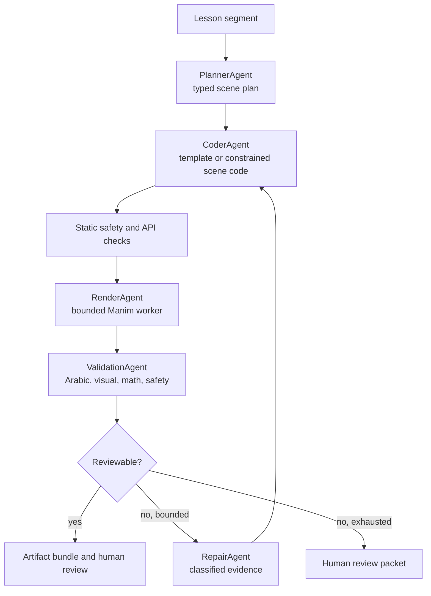
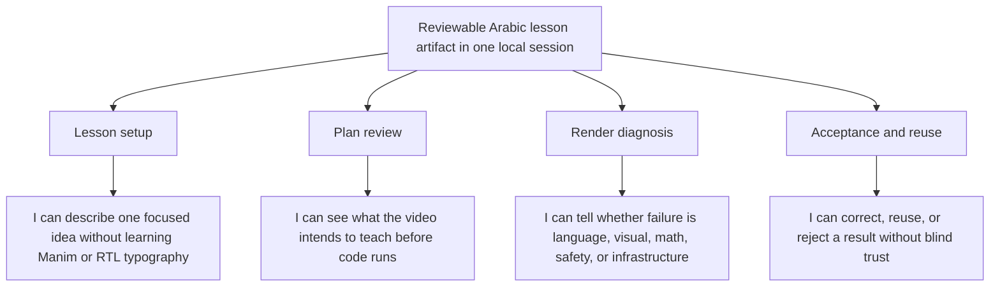

# Manim and agent landscape

**Status:** Working strategy note
**Date:** 2026-07-18
**Scope:** Manim CE templates, Arabic rendering, the open Bayan PRs, and the
agent patterns in Code2Video and related Manim skills.

## Executive decision

Bayan should become an Arabic-first, reviewable Manim workflow rather than a
thin prompt-to-Python wrapper. The next vertical slice should:

1. accept one focused lesson segment;
2. produce a platform-neutral scene plan;
3. compose or generate a constrained Manim CE scene;
4. render it in a bounded worker;
5. emit a video, manifest, and validation report that a person can review.

The Manim quickstart examples should become small, tested Arabic template
fixtures. Animo is useful as product inspiration for templates, local preview,
editable code, and feedback, but its website templates and gallery should not
be copied unless their individual licence permits it.

Code2Video's Planner/Coder/Critic shape is a useful later orchestration model.
It should be adapted behind Bayan's existing `Scene plan`, `Render job`,
`Artifact`, and `Validation result` vocabulary instead of imported wholesale.

## Current evidence

### Mainline

The latest `main` commit is `0330e12` (`chore: move Manim skill to project
scope`). The recent mainline work is foundation and documentation:

- Arabic shaping helpers and the `ArabicSanityCheck` scene;
- a project-scoped `.agents/skills/manim-video/` skill with progressive
  references and tests;
- the architecture, domain model, North Star, and render-isolation decisions.

It does not yet contain the LLM client, dynamic renderer, or Typer workflow.

Local baseline on Manim Community Edition 0.20.1:

- `uv run pytest -q`: 17 passed;
- Arabic low-quality render: passed;
- final Arabic smoke frame: connected glyphs and readable right-to-left text.

### Open PRs

| PR | Proposal | Decision implication |
|---|---|---|
| [#16](https://github.com/abodacs/bayan-manim-video-generator/pull/16) | Arabic helper plus an LLM code client | Useful provider seam, but it jumps directly from prompt to executable code and includes provider/test inconsistencies. |
| [#17](https://github.com/abodacs/bayan-manim-video-generator/pull/17) | Temporary Manim executor and error parsing | Useful render adapter, but `TemporaryDirectory` alone is not a security boundary and the worker has no explicit resource policy. It is stacked on PR #16. |
| [#30](https://github.com/abodacs/bayan-manim-video-generator/pull/30) | Combined Typer, generator, executor, and tests | Closest to an end-to-end slice, but duplicates the stacked PRs and needs contract, CLI, provider, Arabic, and safety corrections before merge. |

The PRs should be reconciled into one coherent sequence of small commits, not
merged as three competing versions of the same pipeline.

## Manim at the level Bayan needs to understand it

Manim is a Python scene engine. The useful conceptual chain is:

```text
Scene.construct()
  -> create named Mobjects
  -> position and style their state
  -> pass Animations to Scene.play()
  -> render frames and encode a video
```

- A `Scene` owns the timeline and the visible objects.
- A `Mobject` is a visible object with geometry, style, position, and child
  submobjects. Shapes, text, equations, groups, images, and graphs are all
  mobjects.
- An `Animation` describes how a mobject enters, leaves, or changes. The basic
  templates use `Create`, `Write`, `FadeIn`, `FadeOut`, `Transform`, and
  `ReplacementTransform`.
- `.animate` turns a state-changing mobject method into an animation. It is
  convenient, but its interpolation is not identical to every explicit
  animation; the official quickstart demonstrates why `Rotate` can be safer
  than `.animate.rotate()` for a full turn.
- Positioning is part of the explanation: `next_to`, `move_to`, `to_edge`,
  `arrange`, and coordinate systems express relationships rather than just
  pixel placement.
- `VGroup` is for compatible vectorized mobjects. `Group` is the safe cleanup
  choice when a scene contains mixed mobject types.
- `MathTex`, `Tex`, matrices, numbered axes, and some number objects require
  LaTeX care. A template must declare whether it needs LaTeX or can use text,
  Unicode, and manual labels.
- Bayan targets Manim Community Edition (`manim` and `Scene`), not ManimGL
  (`manimgl` and `manimlib`). The two APIs are not interchangeable.

This means a scene template should be a tested, inspectable composition of
Manim primitives, not merely a prompt example.

## Arabic rendering contract

The current project has two different ideas that need to be made explicit:

1. `ArabicText` delegates text shaping to Manim/Pango and keeps the raw Arabic
   string.
2. `reshape_arabic_text` applies `arabic-reshaper` and BiDi ordering as a
   separate utility, while `rtl_glyphs` reverses text submobjects for a visual
   glyph reveal.

The next implementation should choose and document one path per use case:

- use `ArabicText` for normal Arabic text layout;
- use `rtl_glyphs` for a deliberate right-to-left glyph animation;
- test mixed Arabic, Latin, punctuation, and numbers before calling the
  result correct;
- do not make generated code guess between `text[::-1]`, pre-reshaping, and
  glyph reversal;
- keep the Arabic helper behind the scene-plan/generator boundary so generated
  code receives a stable project API.

The current PR prompt that recommends `Write(arabic_text[::-1])` conflicts
with this contract and should not be adopted unchanged.

## Template plan

### First-party quickstart fixtures

Manim's official quickstart gives a compact progression that exercises the
library's core model:

| Fixture | Arabic teaching adaptation | Main API exercised |
|---|---|---|
| Create circle | `إنشاء دائرة` | `Scene`, `Circle`, `set_fill`, `Create` |
| Square to circle | `تحويل المربع إلى دائرة` | `Transform`, `FadeOut` |
| Square and circle | `مربع ودائرة` | `next_to`, simultaneous `Create` |
| Animated square to circle | `تدوير ثم تحويل` | `.animate`, explicit `Transform` |
| Rotation comparison | `مقارنة الدوران` | `Rotate` versus `.animate.rotate` |
| Transform cycle | `دورة التحويل` | repeated `Transform` and lifecycle control |

Each fixture should retain English class and file identifiers for Python
stability, but use manually authored Arabic labels/comments as string literals
where appropriate. Each one should have a low-quality render test or a
documented visual review frame.

### What to borrow from Animo

Animo demonstrates a compelling workflow: describe an animation in natural
language, see a local/live preview, inspect and edit the generated Manim code,
reuse templates, and receive feedback. Its public pages also point to broad
template categories such as physics, algebra, astronomy, and chemistry, plus
multiple export formats and aspect ratios.

For Bayan, the transferable product ideas are:

- a browsable template catalogue with a short “when to use this” description;
- fast draft rendering before production quality;
- code ownership and inspectability;
- feedback attached to a render rather than hidden in a chat transcript;
- aspect ratio and export configuration as explicit render metadata.

The safe implementation is to recreate these patterns with Bayan-authored
templates. The Animo terms say that its website materials are owned by Animo,
while user-generated videos have a separate public-domain statement. Treat
the templates, gallery code, images, and brand assets as protected unless an
individual item provides a compatible licence.

## What the referenced skills teach us

### Hermes Manim skill and issue #23969

The skill's strong idea is a complete plan → code → render → review loop. The
linked issue is equally important because it identifies failure modes in the
older guidance:

- proportional fonts are valid; a blanket monospace rule is wrong;
- mixed scene cleanup needs `Group`, not blindly `VGroup`;
- LaTeX dependencies must be surfaced with fallbacks;
- one focused concept per scene is better than a large stage-filled scene;
- `MovingCameraScene` and deliberate pacing are part of educational craft;
- quality needs visual and mathematical review, not only Python compilation.

The project-scoped skill already incorporates these corrections. It should be
treated as the local standard, while upstream Hermes content remains a source
of ideas rather than an unreviewed copy target.

### `adithya-s-k/manim_skill`

This repository is useful for its separation of Manim CE and ManimGL, its
feature-specific rules, tested examples, and example-validation test runner.
The most useful Bayan adaptation is a small CE-only template test harness:

```text
template source
  -> import/API check
  -> low-quality render
  -> Arabic/mixed-script check
  -> visual review evidence
```

Do not add ManimGL just because it appears in the reference repository. It is a
separate framework and would multiply the compatibility surface before Bayan's
first CE workflow is stable.

## Code2Video: what Bayan can actually use

Code2Video describes an agentic, code-centric system with three named roles:
Planner, Coder, and Critic. Its implementation expands that into outline and
storyboard generation, per-section code, render/debug retries, visual-layout
feedback, optional external assets, parallel section renders, stitching, and
evaluation of knowledge transfer, aesthetics, and efficiency.

### Adaptable capabilities

| Code2Video capability | Bayan adaptation | Timing |
|---|---|---|
| Outline from a knowledge point | `PlannerAgent` produces a typed lesson segment and scene plan | Now, deterministic first |
| Storyboard with sections | Scene-plan contract with one conceptual point per scene | Now |
| Per-section code generation | `CoderAgent` generates only the allowed scene representation or thin Manim adapter | Next |
| Error-driven repair | `RepairAgent` receives a classified traceback and one bounded repair request | Now for syntax/API, with a hard attempt limit |
| Grid anchors and layout critic | Safe-frame/layout validation with named anchors, not a hard-coded left/right lecture layout | Next |
| Video-aware critic | `VisualCriticAgent` reviews selected stills and returns structured findings | Next |
| External icon assets | Approved local asset catalogue with provenance; no generated network access | Later |
| Parallel topic/section rendering | Batch CLI after one job is reproducible and resource-bounded | Later |
| Knowledge-transfer and aesthetic evaluation | Arabic correctness, content/math correctness, visual readability, acceptance, time, and cost metrics | Next |
| Shell scripts for single/all topics | Typer commands with one consistent configuration and artifact directory | Now |

### Capabilities to reject or constrain

- Do not make one large 900-line agent class the domain model.
- Do not let generated code download assets, use arbitrary paths, or inherit
  secrets and network access.
- Do not accept a video because it rendered; content and Arabic validation are
  separate results.
- Do not start with ten retries and parallel workers. First make one failure
  reproducible and one repair explainable.
- Do not make a visual-language model mandatory for the first local slice.

### Proposed agent graph



The first useful version can implement Planner, Coder, Render, and Validation
as typed Python services called by the CLI. “Agent” should describe a role and
contract, not require a separate autonomous process for every step.

## CLI shape

The CLI should expose the workflow stages without hiding the artifacts:

```text
bayan template list
bayan template copy <name> --output <dir>
bayan plan --input lesson.json --output run/
bayan generate --run run/
bayan render --run run/ --quality low
bayan validate --run run/
bayan run --input lesson.json --output run/
```

`bayan run` is the convenience command. The stage commands are the debugging
and human-in-the-loop interface. A render directory should make these objects
visible:

```text
run/
├── lesson.json
├── scene_plan.json
├── scene.py
├── render.log
├── artifacts/
│   ├── draft.mp4
│   └── preview.png
├── validation.json
├── manifest.json
└── review_packet.md
```

This is more valuable than returning only `output.mp4`, because an educator or
developer can understand what happened and reproduce it.

## Product strategy residue

### Bounded outcome

Within one local session, an Arabic-speaking educator or developer can turn one
focused lesson segment into a reviewable artifact containing a scene plan, a
draft video, and an Arabic validation result without hand-solving RTL layout.

This is still an assumption-led outcome; the repository has no user interviews
or usage telemetry yet. Add time-to-first-reviewable-artifact and human
acceptance as the first measurable signals.

### Opportunity tree



### Top bets and cheap tests

1. **Arabic template catalogue.** We believe tested templates shorten the path
   from idea to first useful scene. Test with six quickstart fixtures and three
   manually translated lesson prompts; measure render success and time to a
   reviewable frame.
2. **Typed plan plus bounded executor.** We believe inspectable intent and
   predictable failure stages are more valuable than raw prompt-to-code speed.
   Test with one deterministic plan, one valid render, one syntax failure, and
   one Arabic layout failure; ask a reviewer to diagnose each from the bundle.
3. **Planner/Coder/Validator roles.** We believe separating teaching intent,
   code generation, and validation improves trust. Test against direct prompt →
   code generation on three small concepts; compare correction count, render
   success, and acceptance.

## Now / Next / Later

### Now

- Reconcile PRs #16, #17, and #30 into one contract-first branch.
- Fix provider configuration and test disagreement before adding providers.
- Define the scene-plan and render-job data contracts.
- Add the six official quickstart-derived Arabic fixtures and visual evidence.
- Harden the executor boundary: explicit command, timeout, output directory,
  environment allowlist, resource policy, and structured diagnostics.
- Expose stage-level CLI commands and a reproducibility manifest.

### Next

- Add a deterministic template composer and a model-assisted planner behind
  the same scene-plan contract.
- Add bounded syntax/API repair and Arabic/mixed-script validation.
- Add still-frame visual critique and structured repair findings.
- Add a small benchmark of three to ten Arabic lesson segments with human
  review labels.

### Later

- Parallel batch generation, queues, persistence, and multi-provider support.
- Approved local asset packs with provenance.
- Audio/narration after the visual cut is stable.
- VLM layout critique, knowledge-transfer evaluation, and export profiles for
  landscape, portrait, and square output.

## Open decisions

- Is the first primary user an educator, a developer, or an educator supported
  by a developer? This changes the CLI input and review language.
- Is the canonical input a structured lesson segment, a natural-language prompt,
  or both with a prompt-to-plan adapter?
- Should the first generated representation be constrained scene data or raw
  Python? The safer recommendation is data first, raw Python only at the worker
  boundary.
- Which Arabic shaping path is canonical for normal text and for glyph-level
  animation?
- Should PR #30 be repaired as the integration branch, or should PRs #16 and
  #17 be rewritten as separate vertical slices?
- Which validation results block acceptance, and which are advisory?

## Sources

- [Manim Community quickstart](https://docs.manim.community/en/stable/tutorials/quickstart.html)
- [Manim Community contributing guide](https://docs.manim.community/en/stable/contributing.html)
- [Manim Community license](https://github.com/ManimCommunity/manim/blob/main/LICENSE)
- [Animo templates](https://animo.video/templates)
- [Animo gallery](https://animo.video/gallery)
- [Animo product/about pages](https://animo.video/en/about)
- [Animo terms and conditions](https://animo.video/terms-and-conditions)
- [Hermes Manim skill](https://github.com/NousResearch/hermes-agent/tree/main/skills/creative/manim-video)
- [Hermes issue #23969](https://github.com/NousResearch/hermes-agent/issues/23969)
- [adithya-s-k/manim_skill](https://github.com/adithya-s-k/manim_skill/tree/main)
- [showlab/Code2Video](https://github.com/showlab/Code2Video)
- [Code2Video agent implementation](https://github.com/showlab/Code2Video/blob/main/src/agent.py)
